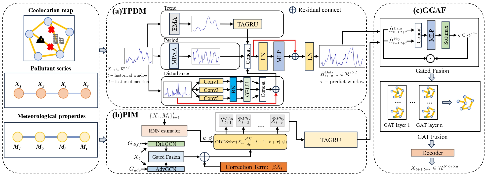

# PI-TPDNet
This repository contains the PyTorch implementation of our ICASSP'26 paper, "PI-TPDNET: A PHYSICS-INFORMED TREND-PERIOD DECOMPOSITION NEURAL NETWORK FOR AIR QUALITY PREDICTION". 

## Datasets
We use two publicly available datasets as described in the paper:
1. **KnowAir**: https://github.com/shuowang-ai/PM2.5-GNN
2. **Airware-Haikou**: https://zenodo.org/records/15379915

## Requirements
     python 3.9
     pytorch 2.2.0
     torch_geometric 2.5.3
     torchdiffeq 0.2.3
> pip install -r requirements.txt

     
All experiments are conducted in PyTorch 2.2.0 on an NVIDIA A800 GPU with a batch size of 64. We use the Adam optimizer with an initial learning rate of 0.005, decaying by 0.1 at scheduled intervals. For TPDM, the EMA smoothing factor is 0.3, TAGRU uses $k=8$, and MPAA employs time granularities of 4 and 8. In PIM, the solver employs the $dopri5$ method with the adjoint method, using relative and absolute tolerances of $1\mathrm{e}{-3}$. In GGAF, 3 GAT layers with 4 attention heads are used. The teacher-gated regularization adopts a balance coefficient of 0.3 and scaling factor $\alpha=5$.

The code used in this work, corresponding to our ICASSP 2026 paper, will be made publicly available upon publication.
